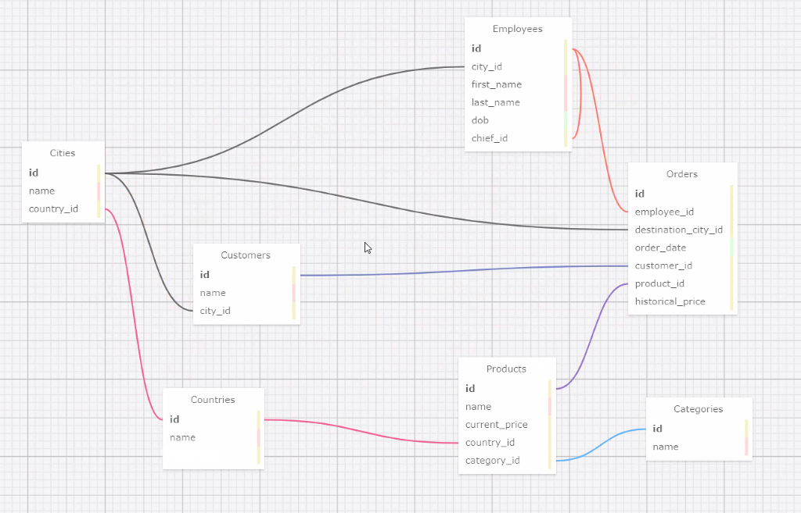

# PostgreSQL relational database on Linux OS

### Task 1 "query": Create relational database with records:
<ol>
  <li>Install PostgreSQL on Linux Ubuntu OS</li>
  <li>Login as 'postgres' user and create new database</li>
  <li>Create tables with fields based on business diagram</li>
  <li>Create logical relationship between tables (CONSTRAINT)</li>
  <li>Insert test data</li>
  <li>Write some test queries</li>
</ol>

Database shema

### Task 2 "usersAndSecurity": Increase security by creating roles, users, manage schema privilegies:
<ol>
  <li>Create Create Role and User with password</li>
  <li>Asign Role, Database and Schema public to current user</li>
  <li>Asign privilegies to the Role</li>
  <li>Login with the user and check if Connect, Create, Select, Delete, Alter work correct</li>
  <li>Try to select user by email and crypt password and update old password with new value by using crypt() function</li>
</ol>

Tools: PostgreSQL, Linux OS

